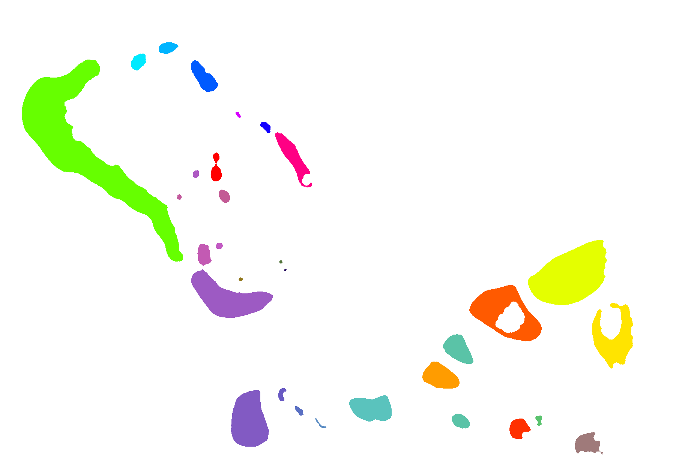

# img-hitmap
An ``-hitmap, that scales with the image.

## Install

    npm install git://github.com/orangemug/img-hitmap.git

## Usage
So you have an generate an image something like this

And an image map which has unique flat colors for each area you want to detect events on

So then you need a config to tell it what events to map to each color

    var config = {
      "#bada55": "bla"
    }

And an array telling it what mouse/touch events should be listened for

    var events = [
      "mousemove",
      "touchmove"
    ]

Then create the hitmap

    var hm = Hitmap.create(imageEl, map, config, events, done);

Where map can be either a url, image object or image element. The config can also be a a url to a json file

But thats all quite complicated so you can make it easier by specifying the map locations in the DOM, so...

    

Then the code simply becomes

    Hitmap.create(el, [
      "mousemove",
      "touchmove"
    ]);

## API
Create a hitmap

    Hitmap.create(imageElement, [map], [config], events);
    // => instance

Get an hitmap

    Hitmap.get(el);
    // => instance

Remove an existing hitmap

    Hitmap.destroy(el);
    // => boolean wether map existed

Events get fired directly on the image element itself, so

    el.addEventListener("hitmap:eventName", function(e) {
      // You can use e.type to work out how it was triggered
    });

Debugging with debug build, by requiring `img-hitmap-debug` you get a few more methods

    var Hitmap = require("img-hitmap-debug");

    // You can also do this per instance basis
    Hitmap.debug(true);    // Show
    Hitmap.debug(false);   // Hide

## License
MIT

